# selfx402-pay-widget

[](https://www.npmjs.com/package/selfx402-pay-widget)
[](https://opensource.org/licenses/MIT)
[](https://www.npmjs.com/package/selfx402-pay-widget)

> 🚀 **Self Protocol + x402 payment widget for React applications**

A production-ready React component library for integrating Self Protocol identity verification and x402 micropayments. Enable proof-of-unique-human verification with instant, gasless USDC payments on Celo.

**Published by [zkNexus](https://www.zknexus.xyz)** - Where proof-of-unique-human meets instant micropayments.

---

## 🎯 Overview

The `selfx402-pay-widget` combines two powerful protocols to create a revolutionary payment experience:

- **Self Protocol**: Zero-knowledge passport verification for Sybil-resistant identity
- **x402 Protocol**: HTTP-native crypto micropayments with EIP-712 signatures
- **Result**: Tiered pricing where verified humans pay 1000-2000x less than bots

### Key Features

✅ **Self Protocol Integration** - One-time passport NFC scan proves unique humanity
✅ **X402 Micropayments** - HTTP 402 status code enables native crypto payments
✅ **Gasless Transactions** - EIP-3009 `transferWithAuthorization` for zero gas fees
✅ **QR & Deep Link Verification** - Multiple methods with real-time polling 🆕
✅ **Mobile-First Design** - Optimized for Self mobile app workflows
✅ **Customizable UI** - Built with Radix UI primitives and Tailwind CSS
✅ **TypeScript** - Full type safety with dual ESM/CJS format
✅ **Production Ready** - Battle-tested, tree-shakeable, <50KB bundle

---

## 📦 Installation

```bash
npm install selfx402-pay-widget
# or
yarn add selfx402-pay-widget
# or
pnpm add selfx402-pay-widget
```

### Peer Dependencies

```bash
npm install react react-dom
```

**Note**: If using the widget with Wagmi integration, install:
```bash
npm install wagmi viem @tanstack/react-query
```

---

## 🏗️ Architecture

### System Architecture


### Component Hierarchy


---

## 🔄 Payment Flow

### Complete Verification & Payment Sequence

```mermaid
sequenceDiagram
    actor User
    participant Widget as Payment Widget
    participant SelfApp as Self Mobile App
    participant Facilitator as Selfx402 Facilitator
    participant Vendor as Vendor API
    participant Celo as Celo Network

    %% Self Protocol Verification
    Note over User,Facilitator: Phase 1: Self Protocol Verification

    User->>Widget: Open payment widget
    Widget->>Widget: Generate QR code + session ID
    Widget-->>User: Display QR code

    alt QR Code Flow
        User->>SelfApp: Scan QR code
    else Deep Link Flow
        User->>Widget: Click "Copy Universal Link"
        Widget->>Widget: Start polling (2s interval)
        User->>SelfApp: Paste link, open Self app
    end

    SelfApp->>SelfApp: Read passport via NFC
    SelfApp->>SelfApp: Generate ZK proof
    SelfApp->>Facilitator: POST /api/verify (proof + sessionId)
    Facilitator->>Facilitator: Verify ZK proof
    Facilitator->>Facilitator: Store session in DB
    Facilitator-->>SelfApp: ✅ Verification success

    alt QR Flow
        SelfApp-->>Widget: Direct callback
    else Deep Link Flow
        Widget->>Facilitator: Poll GET /verify-status/:sessionId
        Facilitator-->>Widget: {verified: true, nullifier}
    end

    Widget->>Widget: Store proof in localStorage
    Widget->>Widget: Enable "Pay & Submit" button

    %% x402 Payment Flow
    Note over User,Celo: Phase 2: x402 Payment Settlement

    User->>Widget: Click "Pay & Submit"
    Widget->>Vendor: GET /.well-known/x402
    Vendor-->>Widget: Payment config (price, network)

    Widget->>Widget: Create EIP-712 authorization
    Widget->>User: Request signature
    User->>Widget: Approve EIP-712 signature

    Widget->>Vendor: POST /api/endpoint + X-Payment header
    Vendor->>Facilitator: POST /verify-celo (signature)
    Facilitator->>Facilitator: Verify EIP-712 signature
    Facilitator-->>Vendor: ✅ Signature valid

    Vendor->>Facilitator: POST /settle-celo (authorization)
    Facilitator->>Celo: transferWithAuthorization (EIP-3009)
    Celo->>Celo: Transfer USDC (gasless)
    Celo-->>Facilitator: ✅ txHash
    Facilitator-->>Vendor: Settlement proof

    Vendor->>Vendor: Process protected request
    Vendor-->>Widget: API response + settlement data

    Widget->>Widget: Show success screen
    Widget-->>User: Transaction complete! 🎉
```



### Deep Link Verification Flow (New!)


---

## 🚀 Quick Start

### 1. Basic Usage

```tsx
import { PaymentForm } from 'selfx402-pay-widget'
import 'selfx402-pay-widget/styles.css'

function App() {
  return (
    <PaymentForm
      vendorUrl="https://api.yourvendor.com"
      apiEndpoint="/api/protected-resource"
      onPaymentSuccess={(data) => {
        console.log('Payment successful!', data)
        console.log('Transaction Hash:', data.txHash)
        console.log('API Response:', data.apiResponse)
      }}
      onPaymentError={(error) => {
        console.error('Payment failed:', error)
      }}
    />
  )
}
```

### 2. With Wagmi Integration

```tsx
import { PaymentForm, type WagmiConfig } from 'selfx402-pay-widget'
import { useAccount, useSignTypedData, useChainId, useConfig } from 'wagmi'
import { useMemo } from 'react'

function PaymentPage() {
  const wagmiConfig = useConfig()
  const { address, isConnected } = useAccount()
  const chainId = useChainId()
  const { signTypedDataAsync } = useSignTypedData()
  const { refetch: readContract } = useReadContract()

  const wagmiConfigProp: WagmiConfig = useMemo(() => ({
    config: wagmiConfig,
    address,
    isConnected,
    chainId,
    signTypedDataAsync,
    readContract: async (args: any) => {
      const result = await readContract(args as any)
      return result.data
    }
  }), [wagmiConfig, address, isConnected, chainId, signTypedDataAsync, readContract])

  return (
    <PaymentForm
      wagmiConfig={wagmiConfigProp}
      vendorUrl="https://api.vendor.com"
      apiEndpoint="/api/demo"
      facilitatorUrl="https://facilitator.selfx402.xyz"
      selfEndpoint="https://facilitator.selfx402.xyz/api/verify"
      selfAppName="Your App"
      selfScope="your-unique-scope"
    />
  )
}
```

### 3. Environment Configuration

Create `.env` file:

```bash
# Self Protocol Configuration (required)
NEXT_PUBLIC_SELF_ENDPOINT=https://your-facilitator.ngrok.io/api/verify
NEXT_PUBLIC_SELF_APP_NAME="Your App Name"
NEXT_PUBLIC_SELF_SCOPE="your-unique-scope"

# Facilitator URL (required)
NEXT_PUBLIC_FACILITATOR_URL=https://your-facilitator.ngrok.io

# Vendor API (optional, can be passed as prop)
NEXT_PUBLIC_VENDOR_API_URL=https://api.vendor.com

# Blockchain Configuration
NEXT_PUBLIC_USDC_ADDRESS=0xcebA9300f2b948710d2653dD7B07f33A8B32118C
```

**Important Notes**:
- `NEXT_PUBLIC_SELF_ENDPOINT` must be **publicly accessible** (use ngrok for local dev)
- `NEXT_PUBLIC_SELF_SCOPE` must **match your Facilitator configuration exactly**
- USDC address is for Celo mainnet (Chain ID: 42220)

---

## 📋 Components

### PaymentForm (Full-Featured)

Two-column layout with detailed disclosure requirements and comprehensive UI.

```tsx
<PaymentForm
  vendorUrl="https://api.vendor.com"
  apiEndpoint="/api/demo"
  facilitatorUrl="https://facilitator.selfx402.xyz"
  selfEndpoint="https://facilitator.selfx402.xyz/api/verify"
  selfAppName="Your App"
  selfScope="your-unique-scope"
  showDeepLink={false} // false = QR only, true = deep link only, 'both' = show both, 'hide' = hidden QR + deep link
  queryParams={{ format: "json", limit: 10 }}
  requestBody={{ filters: { verified: true } }}
  httpMethod="GET"
  onPaymentSuccess={(data) => {
    console.log('TX Hash:', data.txHash)
    console.log('Amount:', data.amount)
    console.log('Recipient:', data.recipient)
    console.log('API Response:', data.apiResponse)
  }}
  onPaymentError={(error) => {
    console.error('Payment failed:', error)
  }}
  onVerificationSuccess={(nullifier) => {
    console.log('Verified! Nullifier:', nullifier)
  }}
/>
```

**Props**:
- `vendorUrl` - Vendor API base URL (default: `NEXT_PUBLIC_VENDOR_API_URL`)
- `apiEndpoint` - Protected API endpoint path (default: `/api/demo`)
- `facilitatorUrl` - Facilitator base URL (default: `NEXT_PUBLIC_FACILITATOR_URL`)
- `selfEndpoint` - Self verification endpoint (default: `NEXT_PUBLIC_SELF_ENDPOINT`)
- `selfAppName` - Display name in Self app (default: `NEXT_PUBLIC_SELF_APP_NAME`)
- `selfScope` - Unique app identifier (default: `NEXT_PUBLIC_SELF_SCOPE`)
- `showDeepLink` - Verification method: `false` (QR only), `true` (deep link only), `'both'`, `'hide'`
- `queryParams` - Query parameters for GET requests
- `requestBody` - Request body for POST/PUT/DELETE requests
- `httpMethod` - HTTP method: `'GET'` | `'POST'` | `'PUT'` | `'DELETE'` (default: `'GET'`)
- `wagmiConfig` - Optional Wagmi configuration object
- `onPaymentSuccess` - Success callback with transaction and API data
- `onPaymentError` - Error callback
- `onVerificationSuccess` - Verification callback with nullifier

### PaymentFormMinimal (Compact)

Single-column layout optimized for mobile and embedded use cases.

```tsx
<PaymentFormMinimal
  vendorUrl="https://api.vendor.com"
  apiEndpoint="/api/demo"
  showDeepLink="both"
  onPaymentSuccess={(data) => console.log('Success!', data)}
/>
```

**Features**:
- ✅ Compact single-column layout
- ✅ Same functionality as full version
- ✅ Optimized for mobile screens
- ✅ Minimal visual footprint

### PaymentSuccess (Transaction Confirmation)

Transaction success screen with confetti animation and details.

```tsx
<PaymentSuccess
  txHash="0x123..."
  amount="0.001"
  recipient="Acme Corp"
  payTo="0x742d35Cc..."
  onClose={() => setPaymentComplete(false)}
  apiResponse={{
    data: 'Your protected resource data',
    timestamp: '2025-10-30T12:00:00Z'
  }}
/>
```

**Features**:
- 🎉 Confetti animation on success
- 🔗 Celoscan transaction link
- 📊 Transaction details display
- 📦 API response viewer
- ✅ Copy buttons for addresses/hash

---

## 🎨 UI Components

### Exported Radix UI Components

Build custom payment interfaces with our pre-styled components:

```tsx
import {
  Button,
  Card,
  CardHeader,
  CardTitle,
  CardDescription,
  CardContent,
  CardFooter,
  Input,
  Label
} from 'selfx402-pay-widget'

function CustomPaymentForm() {
  return (
    <Card className="w-full max-w-md">
      <CardHeader>
        <CardTitle>Custom Payment</CardTitle>
        <CardDescription>Pay with USDC on Celo</CardDescription>
      </CardHeader>
      <CardContent className="space-y-4">
        <div>
          <Label htmlFor="amount">Amount (USD)</Label>
          <Input id="amount" type="number" placeholder="0.001" />
        </div>
        <Button className="w-full">Pay Now</Button>
      </CardContent>
      <CardFooter className="text-sm text-muted-foreground">
        Powered by Self Protocol + x402
      </CardFooter>
    </Card>
  )
}
```

**Available Components**:
- `Button` - With variants: default, destructive, outline, secondary, ghost, link
- `Card`, `CardHeader`, `CardTitle`, `CardDescription`, `CardContent`, `CardFooter` - Card layout primitives
- `Input` - Styled text input with focus states
- `Label` - Accessible form label

---

## 🔧 Advanced Configuration

### Deep Link Verification Setup

**Session ID Format**:
```typescript
// Widget generates session ID and encodes in userDefinedData
const sessionId = crypto.randomUUID() // e.g., "123e4567-e89b-12d3-a456-426614174000"
const userDefinedData = `${sessionId}:${vendorUrl}`
```

**Facilitator Requirements**:
1. Decode `userContextData` from hex to string
2. Extract `sessionId` and `vendorUrl`
3. Store verification in database with 5-minute expiry
4. Implement polling endpoint: `GET /verify-status/:sessionId`

**Database Schema** (example):
```sql
CREATE TABLE verification_sessions (
  session_id VARCHAR(36) PRIMARY KEY,
  nullifier VARCHAR(66) NOT NULL,
  vendor_url TEXT NOT NULL,
  verified BOOLEAN DEFAULT FALSE,
  created_at TIMESTAMP DEFAULT NOW(),
  expires_at TIMESTAMP DEFAULT NOW() + INTERVAL '5 minutes'
);
```

**Polling Endpoint** (example):
```typescript
app.get('/verify-status/:sessionId', async (req, res) => {
  const session = await db.query(
    'SELECT * FROM verification_sessions WHERE session_id = $1 AND expires_at > NOW()',
    [req.params.sessionId]
  )

  if (!session) {
    return res.json({ verified: false, expired: true })
  }

  res.json({
    verified: session.verified,
    nullifier: session.verified ? session.nullifier : null
  })
})
```

### Disclosure Configuration

**Critical**: Widget and vendor configs **must match exactly**.

**Widget Config**:
```typescript
const disclosures = {
  minimumAge: 18,
  ofac: false,
  excludedCountries: [] // MUST match vendor
}
```

**Vendor Config** (`/.well-known/x402`):
```json
{
  "selfProtocol": {
    "enabled": true,
    "requirements": {
      "minimumAge": 18,
      "excludedCountries": [],
      "ofac": false
    }
  }
}
```

**Why?** Self Protocol encodes requirements in the ZK proof circuit. Mismatched configs cause `ConfigMismatchError`.

### Custom Styling

**Override Theme Variables**:

```css
/* global.css */
:root {
  --primary: 210 100% 50%;          /* Primary color (HSL) */
  --background: 0 0% 100%;          /* Background color */
  --foreground: 222.2 84% 4.9%;     /* Text color */
  --card: 0 0% 100%;                /* Card background */
  --card-foreground: 222.2 84% 4.9%; /* Card text */
  --border: 214.3 31.8% 91.4%;      /* Border color */
  --radius: 0.5rem;                 /* Border radius */
}

[data-theme="dark"] {
  --primary: 217.2 91.2% 59.8%;
  --background: 222.2 84% 4.9%;
  --foreground: 210 40% 98%;
  /* ... */
}
```

**Custom Button Styles**:
```tsx
<Button className="bg-gradient-to-r from-purple-500 to-pink-500 hover:from-purple-600 hover:to-pink-600">
  Custom Styled Button
</Button>
```

---

## 📚 API Reference

### PaymentFormProps

```typescript
interface PaymentFormProps {
  // Vendor Configuration
  vendorUrl?: string                    // Vendor API base URL
  apiEndpoint?: string                  // Protected endpoint path

  // Facilitator Configuration
  facilitatorUrl?: string               // Facilitator base URL

  // Self Protocol Configuration
  selfEndpoint?: string                 // Verification endpoint
  selfAppName?: string                  // Display name in Self app
  selfScope?: string                    // Unique app identifier

  // Display Options
  showDeepLink?: boolean | 'both' | 'hide'  // Verification method

  // Request Configuration
  queryParams?: Record<string, any>     // Query params (GET)
  requestBody?: Record<string, any>     // Request body (POST/PUT)
  httpMethod?: 'GET' | 'POST' | 'PUT' | 'DELETE'

  // Wagmi Integration
  wagmiConfig?: WagmiConfig             // Optional Wagmi config

  // Callbacks
  onPaymentSuccess?: (data: PaymentSuccessData) => void
  onPaymentError?: (error: Error) => void
  onVerificationSuccess?: (nullifier: string) => void
}
```

### PaymentSuccessData

```typescript
interface PaymentSuccessData {
  txHash: string          // Celo transaction hash
  amount: string          // Payment amount in USD
  recipient: string       // Vendor name
  payTo: string           // Vendor wallet address
  apiResponse?: any       // Protected API response data
}
```

### WagmiConfig

```typescript
interface WagmiConfig {
  config: Config                           // Wagmi config object
  address?: `0x${string}`                  // Connected wallet address
  isConnected: boolean                     // Connection status
  chainId: number                          // Current chain ID
  signTypedDataAsync: (args: any) => Promise<`0x${string}`>
  readContract: (args: any) => Promise<any>
}
```

---

## 🧪 Testing

### Manual Testing Checklist

**Self Protocol Verification**:
1. ✅ QR code displays on page load
2. ✅ Scan QR with Self mobile app
3. ✅ Complete passport NFC scan
4. ✅ Verify success callback fires
5. ✅ Check "Pay & Submit" button enables

**Deep Link Verification**:
1. ✅ Click "Copy Universal Link"
2. ✅ Paste in phone browser
3. ✅ Verify Self app opens
4. ✅ Complete verification
5. ✅ Check web UI updates automatically (polling)

**x402 Payment**:
1. ✅ Click "Pay & Submit"
2. ✅ Sign EIP-712 authorization
3. ✅ Verify payment processing
4. ✅ Check success screen displays
5. ✅ Verify transaction on Celoscan

### Test Requirements

- **Real passport** (no test mode for Self Protocol)
- **USDC on Celo mainnet** (get from exchanges)
- **Web3 wallet** with Celo network configured
- **Self mobile app** (iOS App Store / Android Play Store)

---

## 🛠️ Development

### Build Commands

```bash
# Install dependencies
npm install

# Build library (ESM + CJS)
npm run build

# Watch mode for development
npm run dev

# Type check
npm run type-check
```

### Project Structure

```
selfx402-pay-widget/
├── src/
│   ├── components/
│   │   ├── payment-form.tsx          # Full payment form
│   │   ├── payment-form-minimal.tsx  # Minimal version
│   │   ├── payment-success.tsx       # Success screen
│   │   └── ui/                       # UI components
│   ├── lib/
│   │   └── utils.ts                  # Utilities
│   ├── assets/
│   │   └── logo.ts                   # Logo asset
│   ├── constants.ts                  # Constants
│   ├── types/
│   │   └── wagmi.ts                  # Type definitions
│   └── index.ts                      # Exports
├── dist/                             # Build output
├── package.json
├── tsconfig.json
└── README.md
```

### Publishing to NPM

```bash
# Bump version
npm version patch|minor|major

# Build and publish
npm publish
```

**Current Version**: 1.0.7

---

## 🌐 Network Support

### Celo Mainnet (Chain ID: 42220) ✅

- **RPC**: `https://forno.celo.org`
- **USDC Contract**: `0xcebA9300f2b948710d2653dD7B07f33A8B32118C`
- **Explorer**: https://celoscan.io
- **Self Protocol**: `0xe57F4773bd9c9d8b6Cd70431117d353298B9f5BF`

**Why Celo?**
- ✅ EIP-3009 USDC support (gasless transfers)
- ✅ Low fees (<$0.01 per transaction)
- ✅ Fast blocks (5 seconds)
- ✅ Mobile-first ecosystem
- ✅ Self Protocol mainnet deployment

---

## 📖 Documentation

### Official Resources

**Self Protocol**:
- [Quickstart Guide](https://docs.self.xyz/use-self/quickstart)
- [Frontend SDK](https://docs.self.xyz/frontend-integration/qrcode-sdk)
- [Backend Integration](https://docs.self.xyz/backend-integration)
- [Deployed Contracts](https://docs.self.xyz/contract-integration/deployed-contracts)

**x402 Protocol**:
- [Protocol Overview](https://x402.gitbook.io/x402)
- [HTTP 402 Concept](https://x402.gitbook.io/x402/core-concepts/http-402)
- [Facilitator Guide](https://x402.gitbook.io/x402/core-concepts/facilitator)
- [Network Support](https://x402.gitbook.io/x402/core-concepts/network-and-token-support)

**Celo Network**:
- [Protocol Docs](https://docs.celo.org/protocol)
- [USDC on Celo](https://docs.celo.org/protocol/tokens/stable-coins)

### Technical Standards

- **EIP-712**: https://eips.ethereum.org/EIPS/eip-712 (Typed Data Signing)
- **EIP-3009**: https://eips.ethereum.org/EIPS/eip-3009 (Gasless Transfers)

---

## 🚀 Related Projects

### NPM Packages

- **[selfx402-pay-widget](https://www.npmjs.com/package/selfx402-pay-widget)** - This package
- **[selfx402-framework](https://www.npmjs.com/package/selfx402-framework)** - Facilitator server framework

### GitHub Repositories

- **[Selfx402Pay](https://github.com/CodaLabs-xyz/Selfx402Pay)** - Consumer demo app
- **[Selfx402Facilitator](https://github.com/CodaLabs-xyz/Selfx402Facilitator)** - Payment verification service
- **[Self-x402](https://github.com/JulioMCruz/Self-x402)** - Complete monorepo

---

## 🤝 Contributing

Contributions welcome! Please follow these guidelines:

1. Fork the repository
2. Create feature branch (`git checkout -b feature/amazing-feature`)
3. Commit changes (`git commit -m 'Add amazing feature'`)
4. Push to branch (`git push origin feature/amazing-feature`)
5. Open Pull Request

**Code Style**:
- TypeScript with strict mode
- Prettier for formatting
- ESLint configuration included
- Conventional commit messages

---

## 📄 License

MIT License

Copyright (c) 2025 zkNexus

Permission is hereby granted, free of charge, to any person obtaining a copy
of this software and associated documentation files (the "Software"), to deal
in the Software without restriction, including without limitation the rights
to use, copy, modify, merge, publish, distribute, sublicense, and/or sell
copies of the Software, and to permit persons to whom the Software is
furnished to do so, subject to the following conditions:

The above copyright notice and this permission notice shall be included in all
copies or substantial portions of the Software.

THE SOFTWARE IS PROVIDED "AS IS", WITHOUT WARRANTY OF ANY KIND, EXPRESS OR
IMPLIED, INCLUDING BUT NOT LIMITED TO THE WARRANTIES OF MERCHANTABILITY,
FITNESS FOR A PARTICULAR PURPOSE AND NONINFRINGEMENT. IN NO EVENT SHALL THE
AUTHORS OR COPYRIGHT HOLDERS BE LIABLE FOR ANY CLAIM, DAMAGES OR OTHER
LIABILITY, WHETHER IN AN ACTION OF CONTRACT, TORT OR OTHERWISE, ARISING FROM,
OUT OF OR IN CONNECTION WITH THE SOFTWARE OR THE USE OR OTHER DEALINGS IN THE
SOFTWARE.

---

## 🙋 Support

**Issues**: https://github.com/CodaLabs-xyz/Selfx402PayWidget/issues

**Contact**:
- 📧 Email: contact@zknexus.xyz
- 🌐 Website: https://www.zknexus.xyz
- 🐦 Twitter: [@zkNexus](https://twitter.com/zkNexus)

**Documentation**:
- 📚 Self Protocol: https://docs.self.xyz
- 📚 x402 Protocol: https://x402.gitbook.io

---

## 🏆 Credits

Built with ❤️ by [zkNexus](https://www.zknexus.xyz)

**Author**: Julio M Cruz ([@JulioMCruz](https://github.com/JulioMCruz))

**Powered by**:
- [Self Protocol](https://www.self.xyz) - Zero-knowledge identity verification
- [x402 Protocol](https://x402.org) - HTTP-native crypto payments
- [Celo Network](https://celo.org) - Mobile-first blockchain
- [Radix UI](https://www.radix-ui.com/) - Accessible component primitives
- [Tailwind CSS](https://tailwindcss.com/) - Utility-first CSS framework

---

**⚡ Built during Self ZK Residency (Oct 14-31, 2025)**

> "Verify once, pay instantly, access everything" - zkNexus

---

## 📊 Package Stats

- **Bundle Size**: ~45KB (minified + gzipped)
- **TypeScript**: 100% type coverage
- **Tree-shakeable**: ESM + CJS dual format
- **Dependencies**: Minimal (7 direct dependencies)
- **React Version**: 18+
- **License**: MIT
